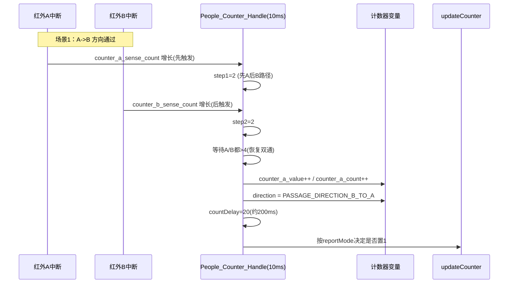
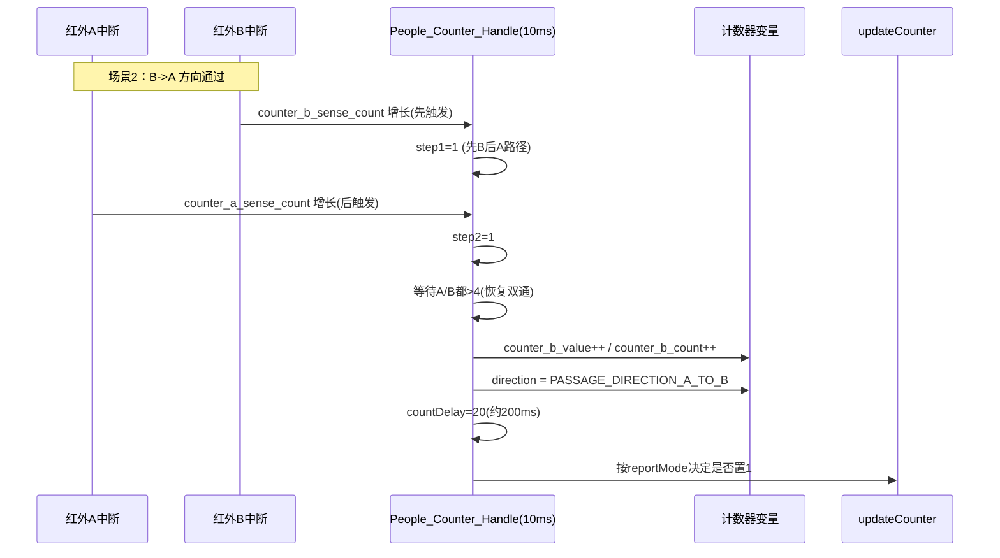
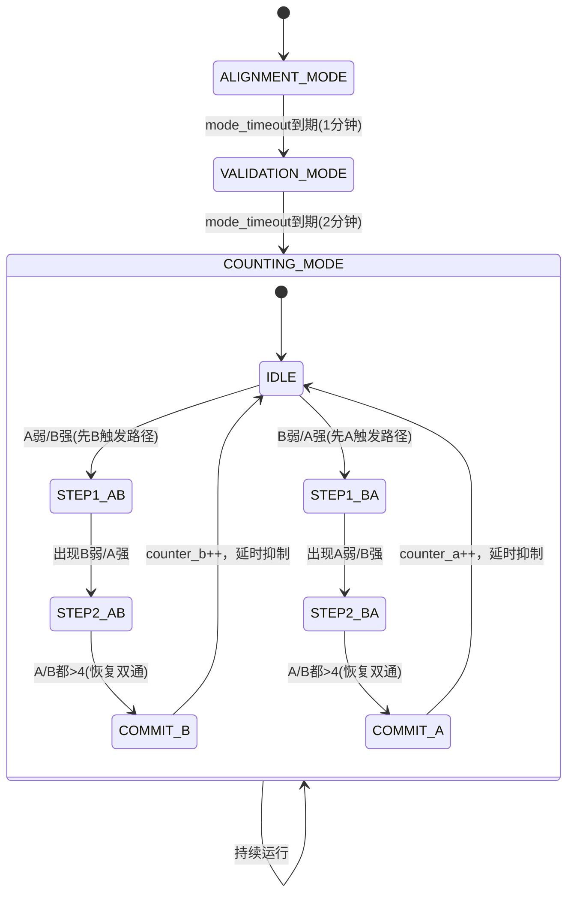
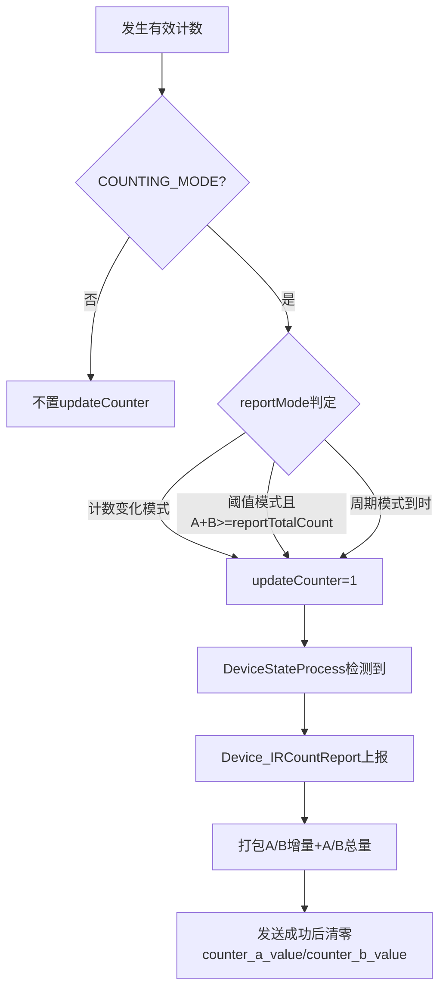
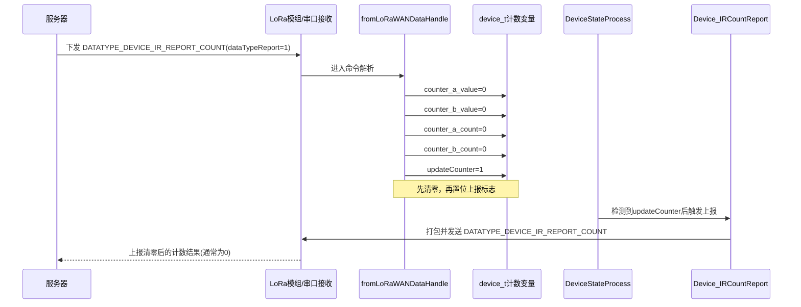

# LoRaWAN 红外计数器计数逻辑说明

## 1. 人员通过计数时序图

### 1.1 A->B 方向通过（最终计入 B）

### 1.2 B->A 方向通过（最终计入 A）

## 2. 模式与计数状态机

## 3. 上报触发流程图

## 4. 服务器下发“清零并上报”命令时序图

## 5. 关键代码位置

- 计数状态机：`USER/Drive/control_center.c` 的 `People_Counter_Handle()`
- 传感器脉冲来源：`USER/Drive/gpio.c` 的 `EXTI4_15_IRQHandler()`
- 周期计时与1ms调度：`USER/Drive/systick.c` 的 `Systick_1ms_Handler()`
- 上报触发与发送：`USER/Drive/communicate.c` 的 `DeviceStateProcess()`、`Device_IRCountReport()`
- 服务器命令解析与清零：`USER/Drive/communicate.c` 的 `fromLoRaWANDataHandle()`

